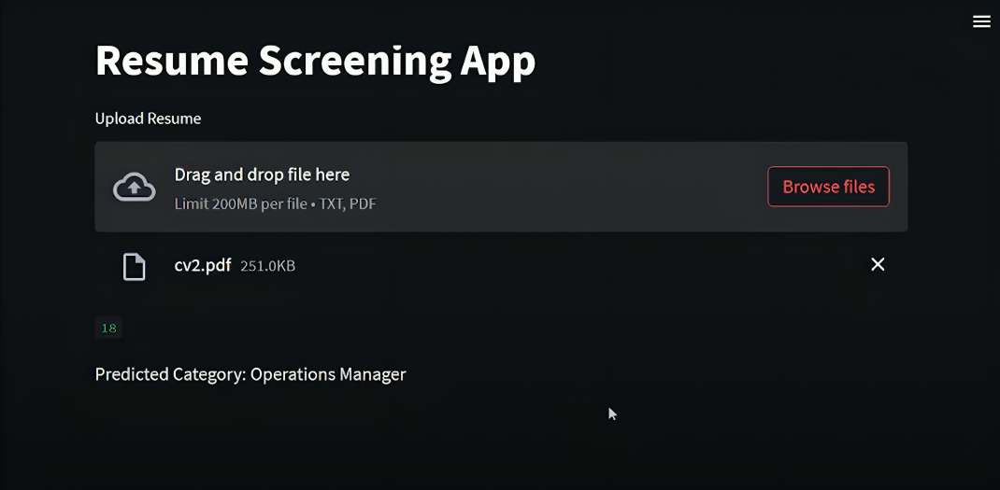

# 📄 ResumeIQ — AI-Powered Resume Screening App


> An intelligent Resume Screening Web Application that automatically classifies resumes into **25 job categories** using NLP (TF-IDF) and Machine Learning (One-vs-Rest + SVC). Now powered with **Google Gemini AI** for resume improvement suggestions and cover letter generation.

---

## 🖥️ App Preview



---

## ✨ Features

| Feature | Description |
|---|---|
| 🎯 **Category Prediction** | Classifies resume into 1 of 25 job roles instantly |
| 📊 **Confidence Scores** | Shows probability % for all 25 categories |
| 🏆 **Resume Quality Score** | Scores resume 0–100 across 5 dimensions |
| 🔑 **Keyword Analysis** | Shows matched & missing role-specific keywords |
| 📂 **Batch Screening** | Upload multiple resumes, get ranked results + CSV export |
| 🔍 **Skills Gap Analysis** | Compare resume vs job description side-by-side |
| 💡 **AI Improvement Tips** | Gemini AI gives 6 personalized improvement suggestions |
| ✉️ **Cover Letter Generator** | Auto-generates cover letter based on your resume |
| ⬇️ **Export to CSV** | Download all batch results as spreadsheet |

---

## 🗂️ Supported Job Categories

`Data Science` `Python Developer` `Java Developer` `Web Designing` `DevOps Engineer`
`HR` `Testing` `Business Analyst` `Network Security Engineer` `Blockchain`
`Sales` `Database` `Hadoop` `ETL Developer` `Operations Manager`
`Mechanical Engineer` `Civil Engineer` `Electrical Engineering` `SAP Developer`
`Automation Testing` `DotNet Developer` `Advocate` `Arts` `Health and fitness` `PMO`

---

## 📊 Dataset

Trained on the [Kaggle Resume Dataset](https://www.kaggle.com/datasets/gauravduttakiit/resume-dataset) with 962 resumes across 25 categories.


---

## 🛠️ Tech Stack

- **Frontend:** Streamlit
- **ML Model:** OneVsRestClassifier + SVC
- **Vectorizer:** TF-IDF
- **AI Features:** Google Gemini 2.0 Flash API (free)
- **Libraries:** scikit-learn, pandas, numpy, PyPDF2, python-docx

---

## ⚙️ Setup & Installation

### 1. Clone the repository
```bash
git clone https://github.com/JiyaBansal01/Resume-Screening-App.git
cd Resume-Screening-App
```

### 2. Install dependencies
```bash
pip install -r requirements.txt
```

### 3. Run the app
```bash
streamlit run app.py
```

### 4. (Optional) Enable AI Features
- Get a **free** Gemini API key at [aistudio.google.com/apikey](https://aistudio.google.com/apikey)
- Paste it in the sidebar of the app
- Unlocks: AI Suggestions + Cover Letter Generator

---

## 📁 Project Structure

```
Resume-Screening-App/
│
├── app.py                          # Main Streamlit application
├── clf.pkl                         # Trained OneVsRest + SVC model
├── tfidf.pkl                       # Fitted TF-IDF vectorizer
├── encoder.pkl                     # Fitted LabelEncoder
├── UpdatedResumeDataSet.csv        # Training dataset
├── Resume Screening with Python.ipynb  # Model training notebook
├── requirements.txt                # Dependencies
└── README.md                       # This file
```

---

## 🚀 How It Works

```
Resume Upload (PDF/DOCX/TXT)
        ↓
   Text Extraction
        ↓
   Text Cleaning (remove URLs, symbols, etc.)
        ↓
   TF-IDF Vectorization
        ↓
   OneVsRest + SVC Prediction
        ↓
   Category + Confidence + Score + Keywords
        ↓
   (Optional) Gemini AI → Suggestions + Cover Letter
```

---

## 📈 Model Performance

| Metric | Value |
|---|---|
| Algorithm | OneVsRestClassifier (SVC) |
| Vectorizer | TF-IDF |
| Categories | 25 job roles |
| Training Data | 962 resumes |

---

## 👩‍💻 Author

**Jiya Bansal**
- GitHub: [@JiyaBansal01](https://github.com/JiyaBansal01)

---

## 📄 License

This project is licensed under the MIT License.

---

⭐ **If you found this useful, please star the repo!**
